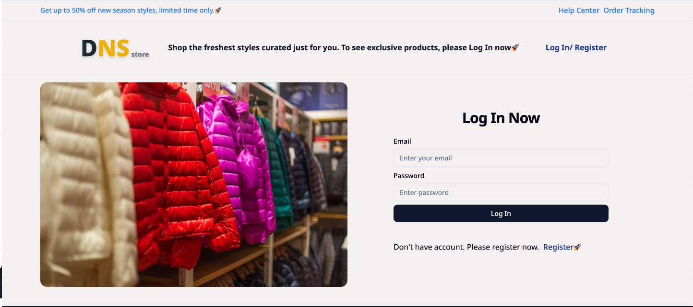

# 🛍️ DNS Store - Modern E-Commerce Frontend



A fully responsive e-commerce frontend built with React, Tailwind CSS, and React Router. Featuring product browsing, cart management, and a sleek user interface.

## 🌟 Features

- **Responsive Design**: Works flawlessly on all devices
- **Product Catalog**: Browse products with category filtering
- **Interactive Cart**: Add/remove items with real-time updates
- **Modern UI**: Clean interface with Tailwind CSS styling
- **Fast Performance**: Built with Vite for optimal speed
- **Easy Navigation**: Intuitive routing with React Router

## 🚀 Tech Stack

- **Frontend**: React + Vite
- **Styling**: Tailwind CSS
- **Routing**: React Router
- **Icons**: React Icons
- **State Management**: Redux
- **Build Tool**: Vite

## 📦 Installation

1. **Clone the repository**:
   ```bash
   git clone https://github.com/budhathokidinesh/E-commerce-Front.git
   cd E-commerce-Front
   ```
2. **Install dependencies**:
   ```bash
   npm install
   ```
3. **Run the development server**:
   ```bash
   yarn dev
   ```
4. **Open in browser**:
   Visit http://localhost:5173

## 🏗️ Project Structure

```bash
E-Commerce-Front
├─ dist
├─ public/
│  └─ b.png
├─ src/
│  ├─ assets/
│  │  ├─ account.jpg
│  │  ├─ b1.jpg
│  │  ├─ b2.jpg
│  │  ├─ b3.jpg
│  │  ├─ b4.jpg
│  │  ├─ db-store.png
│  │  └─ hanging.jpg
│  ├─ components/
│  │  ├─ admin-view/
│  │  │  ├─ AdminHeader.jsx
│  │  │  ├─ AdminLayout.jsx
│  │  │  ├─ AdminOrderDetail.jsx
│  │  │  ├─ AdminOrders.jsx
│  │  │  ├─ AdminProductTile.jsx
│  │  │  ├─ AdminSideBar.jsx
│  │  │  └─ ImageUpload.jsx
│  │  ├─ common/
│  │  │  ├─ check-auth.jsx
│  │  │  ├─ form.jsx
│  │  │  └─ StarRating.jsx
│  │  ├─ layouts/
│  │  │  ├─ DefaultLayouts.jsx
│  │  │  ├─ Footer.jsx
│  │  │  └─ Header.jsx
│  │  ├─ shopping-view/
│  │  │  ├─ Address.jsx
│  │  │  ├─ AddressCard.jsx
│  │  │  ├─ CartItemsContent.jsx
│  │  │  ├─ CartWrapper.jsx
│  │  │  ├─ filter.jsx
│  │  │  ├─ ProductDetails.jsx
│  │  │  ├─ ShoppingHeader.jsx
│  │  │  ├─ ShoppingLayout.jsx
│  │  │  ├─ ShoppingOrderDetail.jsx
│  │  │  ├─ ShoppingOrders.jsx
│  │  │  └─ ShoppingProductTile.jsx
│  │  ├─ SideBar/
│  │  │  └─ CategoryPanel.jsx
│  ├─ config/
│  │  └─ config.js
│  ├─ pages/
│  │  ├─ admin-view/
│  │  │  ├─ Dashboard.jsx
│  │  │  ├─ Features.jsx
│  │  │  ├─ Orders.jsx
│  │  │  └─ Products.jsx
│  │  ├─ auth/
│  │  │  ├─ Login.jsx
│  │  │  └─ Register.jsx
│  │  ├─ not-found/
│  │  │  └─ NotFound.jsx
│  │  ├─ shopping-view/
│  │  │  ├─ PaymentSuccess.jsx
│  │  │  ├─ PaypalReturn.jsx
│  │  │  ├─ SearchProducts.jsx
│  │  │  ├─ ShoppingAccount.jsx
│  │  │  ├─ ShoppingCheckout.jsx
│  │  │  ├─ ShoppingHome.jsx
│  │  │  └─ ShoppingListing.jsx
│  │  ├─ unauth-page/
│  │  │  └─ UnauthPage.jsx
│  │  ├─ utils/
│  │  │  ├─ AboutUs.jsx
│  │  │  ├─ ContactUs.jsx
│  │  │  ├─ FaqPage.jsx
│  │  │  ├─ HelpCenter.jsx
│  │  │  └─ OrderTracking.jsx
│  │  └─ index.js
│  ├─ routes/
│  │  └─ AppRoutes.jsx
│  ├─ store/
│  │  ├─ admin/
│  │  │  ├─ adminOrder-slice/
│  │  │  │  └─ adminOrderSlice.js
│  │  │  └─ product-slice/
│  │  │     └─ productSlice.js
│  │  ├─ auth-slice/
│  │  │  └─ authSlice.js
│  │  ├─ common/
│  │  │  └─ commonSlice.js
│  │  ├─ shop/
│  │  │  ├─ address-slice/
│  │  │  │  └─ addressSlice.js
│  │  │  ├─ cart-slice/
│  │  │  │  └─ cartSlice.js
│  │  │  ├─ order-slice/
│  │  │  │  └─ orderSlice.js
│  │  │  ├─ product-slice/
│  │  │  │  └─ shopProductSlice.js
│  │  │  ├─ review-slice/
│  │  │  │  └─ reviewSlice.js
│  │  │  └─ searchSlice/
│  │  │     └─ searchSlice.js
│  │  └─ store.js
│  ├─ App.css
│  ├─ App.jsx
│  ├─ index.css
│  └─ main.jsx
├─ .env
├─ .gitignore
├─ components.json
├─ eslint.config.js
├─ file_tree.text
├─ index.html
├─ jsconfig.json
├─ package.json
├─ README.md
├─ vite.config.js
└─ yarn.lock
```

## 📦 Deployment

This project is deployed on Netlify.

- Make sure the environment variable VITE_API_URL is set in Netlify.

- Backend is deployed on Render: https://e-commerce-back-a9pp.onrender.com

## 📄 License

This project is open source and available under the MIT License.

## Author

Made with ❤️ by Dinesh Budhathoki
